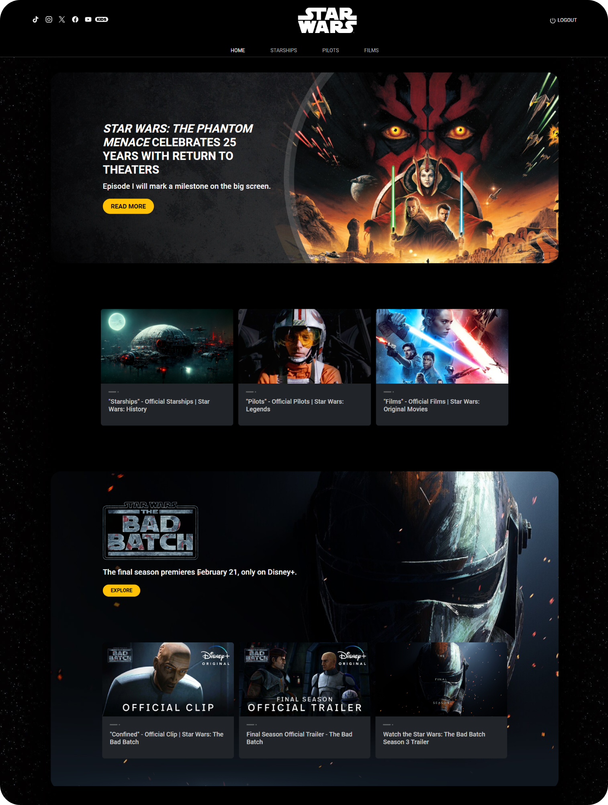

# Sprint 07 - (StarWars API)

This project was generated with [Angular CLI](https://github.com/angular/angular-cli) version 17.1.2.

## Introduction

Welcome to Sprint 07: In this exercise the data will be read from a server.

This delivery is based on a technical test of a large company in the e-commerce sector, which is looking for front-end developers in the city of Barcelona. The technical test consists of: consuming the data from an API, displaying it on a screen through a list and showing the detail of each item in the list.

The website you have to develop must display information about Star Wars ships! The list of ships will have to be shown with the detailed information of each one of them.

## Setup and Installation

To get this project up and running on your local machine, follow these steps:

1. Clone this repository to your local machine.
2. Navigate to the project directory.
3. Install the necessary dependencies:

`npm install`

4. Start local server.

`npm start`

5. Install JSON Server Auth.

[JSON Server Auth Reference](https://www.npmjs.com/package/json-server-auth)

`npm install -g json-server`

`npm i json-server`

`json-server --watch db.json`

6. Login Form credentials.

`Email: demo@demo.com`
`Password: Demo12345`

## Development server

Run `ng serve` for a dev server. Navigate to `http://localhost:4200/`. The application will automatically reload if you change any of the source files.

## Code scaffolding

Run `ng generate component component-name` to generate a new component. You can also use `ng generate directive|pipe|service|class|guard|interface|enum|module`.

## Build

Run `ng build` to build the project. The build artifacts will be stored in the `dist/` directory.

## Running unit tests

Run `ng test` to execute the unit tests via [Karma](https://karma-runner.github.io).

## Running end-to-end tests

Run `ng e2e` to execute the end-to-end tests via a platform of your choice. To use this command, you need to first add a package that implements end-to-end testing capabilities.

## Further help

To get more help on the Angular CLI use `ng help` or go check out the [Angular CLI Overview and Command Reference](https://angular.io/cli) page.
